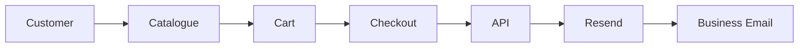
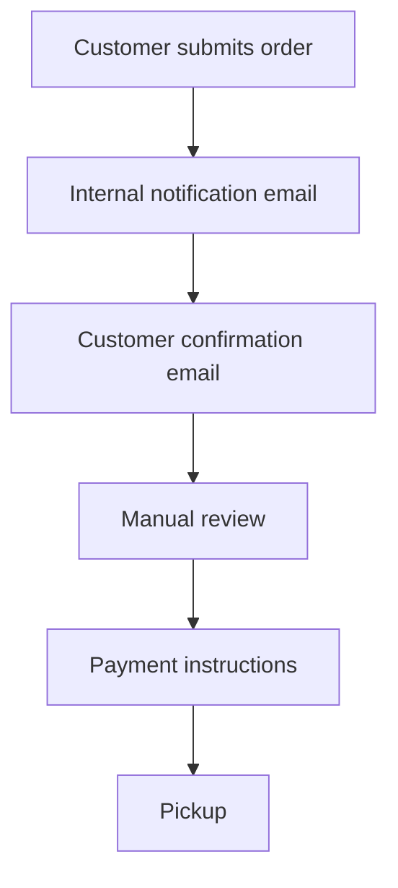

# Suklaamo

[](https://nextjs.org/) [](https://www.typescriptlang.org/) [](https://developers.cloudflare.com/workers/) [](#license)

Suklaamo is a premium artisan chocolate bakery web application for local pickup ordering in Oulu, Finland. It is built as a production-ready storefront with a polished customer experience, validated checkout flow, server-side email notifications, and Cloudflare-compatible deployment.

## Overview

Suklaamo supports a pickup-first bakery business model where customers browse small-batch products, add items to a cart, submit an order request, and receive confirmation by email. The system is intentionally designed for a real commercial workflow: orders are reviewed manually, customer details are validated on the server, policies must be acknowledged before submission, and all notification emails are sent from the backend.

The application is optimized for mobile-first browsing, local SEO, and low-friction ordering. It combines a modern frontend with a lightweight operational backend so the bakery can manage orders without introducing unnecessary complexity.

## Features

### Customer Experience
- Responsive mobile-first storefront
- Animated homepage and catalogue interactions
- Product browsing by category
- Product detail pages with ingredients and product information
- Accessible checkout and policy viewer
- Pickup-focused order request flow

### Ordering
- Persistent shopping cart
- Cart quantity management and order limit enforcement
- Checkout form validation
- Future pickup date validation
- Finnish phone number validation
- Policy acknowledgement required before order submission
- Order total calculation on the client and server

### Notifications
- Internal order notification emails via Resend
- Customer confirmation email with order summary
- Server-side email dispatch from the order API route
- Clear failure handling when required email configuration is missing
- Duplicate recipient protection

### SEO
- App Router metadata support
- OpenGraph and Twitter metadata
- robots.txt route
- sitemap.xml route
- Structured data in the root layout
- Crawlable catalogue and product pages

### Performance
- Static and server-rendered App Router pages where appropriate
- Optimized image handling through a shared SmartImage wrapper
- Framer Motion used selectively for meaningful interactions
- Mobile-first layouts with compact navigation and content hierarchy
- Lightweight state management with Zustand and React Context

### Security
- Server-side validation for order and contact forms
- Input sanitization
- Rate limiting for the order route
- Email sending performed only on the server
- Environment-based secrets and recipient configuration

## Tech Stack

- Next.js 15
- React 19
- TypeScript
- App Router
- Tailwind CSS
- Framer Motion
- Zustand
- React Context
- Resend
- Cloudflare Workers / Cloudflare Pages-compatible runtime
- OpenNext-compatible deployment flow
- ESLint
- PostCSS

## Architecture

Suklaamo follows a simple request-driven architecture.

### App Router Structure
The application uses the Next.js App Router under `app/` for routing, layout composition, metadata, sitemap and robots generation, and API handling. Page-level UI is split by business concern: home, catalogue, product detail, cart, checkout, contact, and legal/system routes.

### State Management
Cart state lives in a shared client-side store using Zustand, while checkout form state is managed locally in the checkout page and validated again on the server. This keeps the cart persistent across navigation while avoiding unnecessary global form state.

### Email Flow
Order submission is handled by `app/api/order/route.ts`. The route validates the payload, checks rate limits, reads runtime environment variables, creates the order payload, sends internal notifications to the business inbox, and sends a customer confirmation email after a successful order request.

### Order Flow


### Deployment Flow
The app is built as a Next.js production bundle and deployed to a Cloudflare-compatible runtime through an OpenNext-style flow. Runtime secrets and recipient inboxes are injected through the deployment platform, and the order API reads them at request time so the same code can run locally and in production.

## Folder Structure

```text
app/
  layout.tsx
  page.tsx
  about/
  cart/
  catalogue/
  checkout/
  contact/
  api/
    contact/route.ts
    order/route.ts
  robots.ts
  sitemap.ts
components/
context/
data/
lib/
public/
```

### Important Folders
- `app/` contains routes, layouts, metadata, and serverless API routes.
- `components/` contains reusable UI components and interactive storefront pieces.
- `context/` holds the shared cart state.
- `data/` contains product data used across the storefront.
- `lib/` contains validation, rate limiting, and email composition helpers.
- `public/` contains static assets such as product images and brand graphics.

## Environment Variables

Configure these variables in your local environment and in your Cloudflare deployment settings.

```dotenv
RESEND_API_KEY=re_xxxxxxxxxxxxxxxxxxxxxxxxxxxxx
RESEND_FROM_EMAIL=order@suklaamo.fi
ORDER_NOTIFICATION_EMAIL=suklaamo@gmail.com
ORDER_NOTIFICATION_EMAIL_CC=mileperuma@gmail.com
```

- `RESEND_API_KEY`: required. Used by the server-side order route to send emails through Resend.
- `RESEND_FROM_EMAIL`: optional, but recommended. Sender identity for outbound order emails.
- `ORDER_NOTIFICATION_EMAIL`: required. Primary inbox for new order notifications.
- `ORDER_NOTIFICATION_EMAIL_CC`: optional, but recommended. Secondary inbox for the same notifications.

### Cloudflare Note
If you deploy on Cloudflare, configure the variables and secrets in the correct environment scope for the deployment target you use, such as Production and Preview. The order route reads runtime values from the Cloudflare request context when available.

## Local Development

Install dependencies and start the development server:

```bash
npm install
npm run dev
```

The site will run on the local Next.js development server.

### Helpful Commands

```bash
npm run build
npm run lint
npm run start
```

## Production Deployment

Suklaamo is designed for a Cloudflare-hosted production deployment.

### Cloudflare Workers
Cloudflare provides the runtime environment for server-side requests, including the order API route and other server-rendered features.

### OpenNext
The project is structured for an OpenNext-compatible build and deployment flow so the Next.js app can run on Cloudflare infrastructure with minimal runtime adaptation.

### Build Process
1. Install dependencies.
2. Build the Next.js application.
3. Deploy the generated output to the Cloudflare runtime.
4. Configure runtime variables and secrets in the deployment dashboard.

### Deployment Steps
1. Set the required environment variables.
2. Run the production build.
3. Deploy the app to Cloudflare.
4. Verify the order API can read the recipient inbox variables at runtime.
5. Confirm email delivery and order submission in production.

## Order Workflow



1. Customer submits an order request through checkout.
2. The server validates the payload and policy acknowledgement.
3. An internal notification email is sent to the business inbox.
4. A customer confirmation email is sent after the order is accepted by the API.
5. The order is manually reviewed.
6. Payment instructions are provided.
7. The customer completes pickup at the agreed time.

## Validation Rules

The checkout and contact flows enforce the following rules:

- Finnish phone validation: accepted in local and international Finnish mobile formats.
- Email validation: basic syntax validation for contact and checkout forms.
- Future pickup dates: pickup must be later than today.
- Policy acknowledgement requirement: checkout submission is blocked until the customer accepts the required policies.
- Maximum order quantity: the cart enforces a maximum total quantity of 10 items.

## Policies

Suklaamo presents three customer-facing policies in checkout and requires acknowledgement before order submission.

- Privacy Policy: explains what data is collected, why it is processed, and how long it is retained.
- Allergen Policy: explains shared kitchen conditions, recognized allergens, and cross-contact limitations.
- Cancellation & Refund Policy: explains order confirmation timing, cancellation windows, and refund handling.

## Performance Considerations

- Image optimization: images are handled through a shared image wrapper to keep layouts stable and loading resilient.
- Static rendering: catalogue and product pages are structured to benefit from static generation where possible.
- Lazy loading: non-critical images and content are loaded progressively to keep first render fast.
- Mobile responsiveness: layouts, spacing, and interactions are designed for small screens first.

## Security

- Environment variables: secrets and inboxes are stored in deployment configuration, not in source control.
- API validation: the order route validates input on the server before sending emails.
- Input sanitization: form values are trimmed and sanitized before use.
- Rate limiting: the order API includes request throttling.
- Server-side email delivery: notification emails are sent only from the backend.

## Accessibility

The UI uses semantic forms, labeled controls, keyboard-accessible actions, and mobile-friendly layouts. The checkout policy viewer is modal-based, supports keyboard dismissal, and is structured to remain usable on small screens. Error states are surfaced near the relevant controls so users can correct problems without guessing.

## SEO

- Metadata: page metadata is defined at the app layout and page level.
- Sitemap: the site exposes a sitemap route for crawl discovery.
- Robots: the site exposes a robots route for crawler instructions.
- OpenGraph: social preview metadata is configured for sharing.
- Structured architecture: product, collection, and business content are laid out in crawlable routes with schema data in the root layout.

## Known Limitations

- Pickup-only business model.
- Manual order confirmation is still required.
- No online payment processing yet.
- Order coordination depends on email delivery.
- Customer accounts and order tracking are not implemented.

## Future Improvements

- Stripe or Paytrail integration
- Customer accounts
- Order dashboard
- CMS integration
- Reviews system
- Automated fulfillment status updates
- Better admin tooling for order management

## Author

Suklaamo

## License

Private commercial project.

---

Developer note: the codebase currently includes a Cloudflare-compatible order API, Resend email delivery, policy acceptance validation, and local cart persistence. If you change deployment providers, verify the runtime env access pattern in `app/api/order/route.ts` first.
